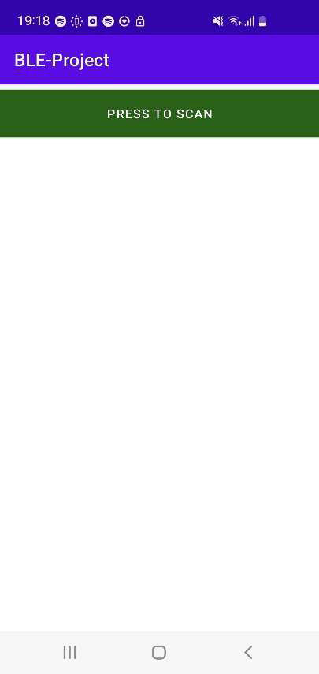
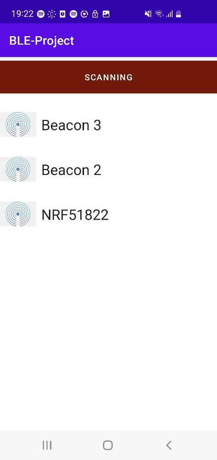
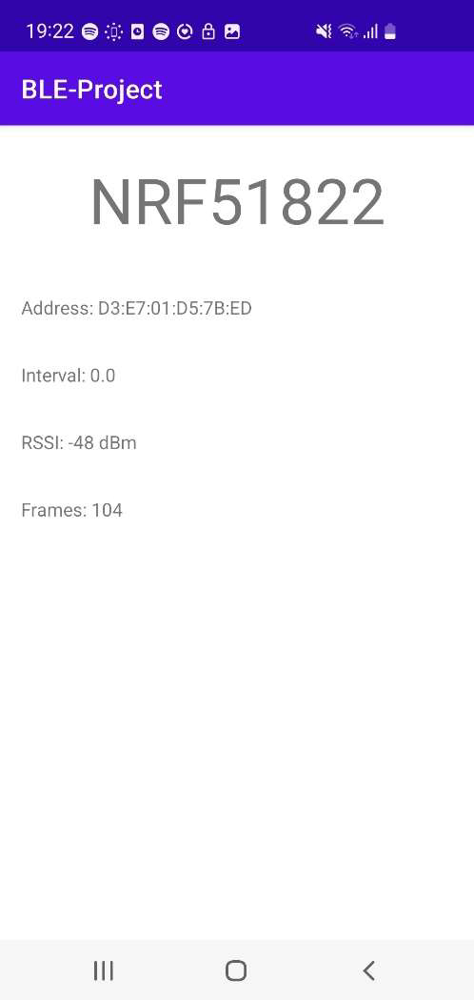

# Bluetooth device scanner - android app

Android app for discovering bluetooth devices.

# Technologies

* Kotlin
* Android

# Description

Application works as a scanner of bluetooth devices that are sending advertisement frames.
For each received frame by application, device that is advertising is added to list of discovered devices.
Application stores all of the discovered devices and count total received frames for each device.
Stored devices can be deleted by swiping down screen.

Figure 1 Main view of application

Figure 2 Application scans for advertising devices

Figure 3 Detail view of discovered/scanned device

